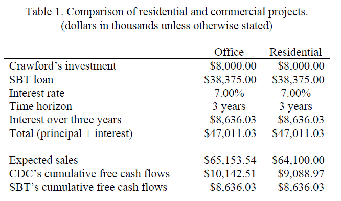
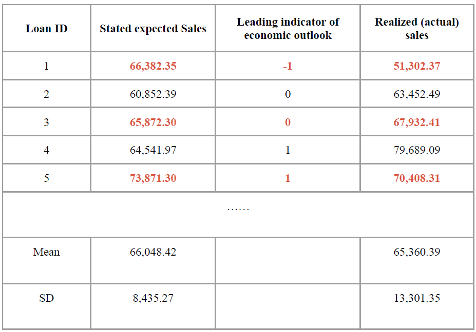

```{r setup, include=FALSE}
knitr::opts_chunk$set(echo = TRUE)
```

## Case Introduction and Analysis Objective

Crawford Development Co. (CDC) approached Southeast Bank of Texas (SBT) for a $38.375 million loan to fund a real estate project in Houston for office or residential development. The loan was structured as a bullet payment with a 7% annual interest rate payable at the end of the loan term.

The objective of this case analysis is to determine the optimal loan arrangement for Southeast Bank of Texas (SBT) in financing a real estate development project proposed by Crawford Development Co. (CDC). This involves conducting a comparison of a residential and an office project, analyzing historical data of CDC's past office projects, and utilizing a methodology that includes sales forecast simulation, cash flow simulation, net present value (NPV) calculation, and interest rate sensitivity analysis. The ultimate goal is to identify the project with the highest potential for success, and to recommend an interest rate that will maximize profits for both CDC and SBT.

## Preliminary Analysis and Information

**1. Comparison of Residential and Commercial Projects**

The initial financial analysis of the profitability of the office park and residential neighborhood project options (Table 1 Below) for CDC and SBT reveals that both project options are profitable for both CDC and SBT. The estimated cumulative CDC Free Cash Flow (FCF) for both Office Park and Residential are $10,142,000 and $9,088,000 respectively while the estimated cumulative SBT FCF for both Office Park and Residential are the same at $8,636,030. The higher Office Park project FCF for CDC might suggest that this project is more profitable over the residential project. It is essential to note that these estimates are based on several assumptions and projections about future market conditions, construction costs, and other factors that may affect the profitability of each project option.

{width=50%}


**2. Office Building Development Historical Data**

Table 2 below displays historical data on three-year business development loans from SBT to CDC for constructing office buildings in Houston, Texas. SBT observed that the difference between stated and realized sales for office projects was associated with the leading indicator of economic outlook because changes in the economic outlook can affect the demand for office buildings and, therefore, impact the actual sales of CDC's projects.
For example, if the economic outlook is optimistic, there may be more demand for office space, resulting in higher realized sales than initially stated. Conversely, if the economic outlook is pessimistic, there may be less demand for office space, resulting in lower realized sales than initially stated. A correlation between the leading indicator of the economic outlook and the difference between stated and realized sales for CDC's office building projects might be able to assist in the deep dive analysis for the loan proposal analysis.

{width=50%}

## Methodology and Process

**1. Assumptions**

Before building the model, a set of the following assumptions are made based on historical market data and transaction data between CDC and SBT:

1) The current indicator for the office project would follow the historical average of previous economic outlooks.

2) The gap between realized (actual) sales and stated expected sales are normally distributed under each leading indicator of economic outlook (-1, 0, 1)

3) The outlook for residential projects would follow the triangular distribution with most likely of $42.3M, lower bound = $20M and upper bound = $130M.

4) The initial construction costs in the residential project are distributed in triangular distribution with the most likely = $20M, lower bound = $18M, upper bound = $22M.

5) Construction costs of office projects and the rest for residential projects are certain.

**2. Sales Forecast Simulation**

Using the assumptions above, sales of each project are forecasted:

For the office project, a mean and standard deviation of the difference between realized (actual) sales and stated expected sales grouped by its historical economic outlook are first computed. Then, Monte Carlo simulation of normal distribution with the derived mean and standard deviation is run by 10,000 trials, with taking consideration of probabilities of historical average of the economic outlook: 12/32, 9/32, and 11/32 for a pessimistic, neutral, and positive economic outlook, respectively.

For the residential project, Monte Carlo simulation of triangular distribution is run by 10,000 trials, bounded by sales of zero, defining that the sales would not be negative.

Below are the step by step approach to simulate the sales forecast

```{r Importing Relevant Libraries, warning=FALSE, message=FALSE}
library(tidyverse)
library(triangle)
library(scales)
options(scipen=9999)
```

```{r}
# Setting seed for reproducibility
set.seed(616)

# Defining input parameter
n_sims <- 10000
mean_sales_office <- 65153540
interest <- 8636030
loan <- 38375000
```

```{r}
################### Simulation for Office Park Project Sales ##################

# Office Sales Function 
office_sales <- function(n_sims, mean_sales){
  outlook <- c(-1, 0, 1)
  probabilities <- c(12/32, 9/32, 11/32)
  simulated_outlook <- replicate(n_sims, sample(outlook, 1, replace = TRUE, prob = probabilities))
  picked_outlook <- sample(simulated_outlook, 1)
  # market outlook based on gap analysis
  if (picked_outlook == -1) {
    gap_sales <- rnorm(n_sims, -10897.29*1000, 4846.559372*1000)
  } else if (picked_outlook == 0) {
    gap_sales <- rnorm(n_sims, 1318.24*1000, 4699.855849*1000)
  } else {
    gap_sales <- rnorm(n_sims, 8807.82*1000, 5718.09711*1000)
  }
  # generating total expected sales
  total_sales <- mean(gap_sales) + mean_sales_office
  return(data.frame(Simulated_Outlook = picked_outlook, Expected_Total_Sales = total_sales))
}

# Simulating market forecast for office park
office_forecast <- office_sales(n_sims, mean_sales_office)
office_forecast

```

```{r}
################### Simulation for Residential Project Sales ##################

residential_sales <- rtriangle(n=n_sims, a=20000000, b=130000000, c=42300000)

```

```{r}
############### Defining Initial Residential Construction Cost  ###############

#Initial Construction Cost Range with 95% CI
expected_cost <- 20000000

# Defining Upper and Lower Bound
tolerance <- 0.1
upper_bound <- expected_cost * (1 + tolerance)
lower_bound <- expected_cost * (1 - tolerance)

# Simulating Initial Construction Cost using Triangular Distribution
min_val <- lower_bound
max_val <- upper_bound
mode_val <- expected_cost
simulated_initial_cost <- rtriangle(n = n_sims, a = min_val, b = max_val, c = mode_val)
```

```{r}
######## Plotting 3 Year Forecast for Both Office and Residential Sales #######

# Office Park
forecast_office <- data.frame(
  Year = c(2008, 2009, 2010),
  Forecasted_Sales = rep(NA, 3)
)
for (i in 1:3) {
  year_sales <- office_sales(n_sims, mean_sales_office)
  forecast_office[i, "Forecasted_Sales"] <- year_sales$Expected_Total_Sales
}
ggplot(forecast_office, aes(x = Year, y = Forecasted_Sales)) +
  geom_point(size=3, color="red") +
  geom_line() +
  labs(title = "Office Sales Forecasts by Year", x = "Year", y = "Forecasted Sales")+
  theme_light()

# Residential
forecast_residential <- data.frame(
  Year=c(2008,2009,2010),
  Forecasted_Sales = sample(residential_sales, 3))

ggplot(forecast_residential, aes(x = Year, y = Forecasted_Sales)) +
  geom_point(size=3, color="red") +
  geom_line() +
  labs(title = "Residential Sales Forecasts by Year", x = "Year", y = "Forecasted Sales")+
  theme_light()
```

**3. Cash Flow Simulation**

After sales forecast, cash flow forecast simulation is conducted separately for CDC and SBT

1) Cash flow simulation for CDC

A primary reason for cash flow simulation for CDC is to account for uncertainty of initial construction costs for residential projects and the nature of a contract that the bank would keep the proceeds from CDC’s sales if it does not meet the amount owed to the bank for principal and interest, a total of $47M.

As assumed that the initial construction costs for the residential projects would follow a triangular distribution with the most likely of $20M, lower bound of $18M, and upper bound of $22M, Monte Carlo simulation for the initial construction costs are generated by 10,000 trials.

According to loan customs, any sales that are less than the amount owed in principal and interest ($47M), it will not be distributed to the debtor (CDC), hence recording them as zero sales. Accounting for factors above, cash flow in both projects for CDC would be sales minus various costs (land, construction, sales and marketing, and repayment of principal and interest.

2) Cash flow simulation for SBT

Cash flow for SBT is the function of sales and costs of CDC over the three years of a loan period. In other words, an initial cash outflow is a fixed value of a loan and repayment of principal and interest would be uncertain in three years.

As mentioned, SBT will be a guaranteed beneficiary of a whole repayment of principal and interest, or any cash generated by CDC’s sales if under $47M.

Below are the step by step approach to simulate the cash flow

- Defining Cash Flow for Both Projects: CDC

```{r}
########################### Office Park Cash Flow ############################

# Incorporating uncertainty in the last cash flow based on the number of sales
last_cashflow_cdc <- office_forecast$Expected_Total_Sales - interest - loan
office_fcf_cdc <- c(37875000, -24375000, -9000000, -12500000, last_cashflow_cdc)
fcf_list_cdc <- vector("list", n_sims)
outlook_list_cdc <- vector("list", n_sims)

for (i in 1:n_sims) {
  office_forecast_cdc <- office_sales(n_sims = 1, mean_sales = mean_sales)
  last_cashflow2 <- data.frame(outlook = office_forecast_cdc$Simulated_Outlook, 
                               cash_flow = office_forecast_cdc$Expected_Total_Sales - interest - loan)
  office_fcf_cdc <- c(37875000,-24375000 , -9000000, -12500000, last_cashflow2$cash_flow)
  outlook_list_cdc[[i]] <- last_cashflow2$outlook #storing simulated outlook to be overlayed at the graph
  fcf_list_cdc[[i]] <- office_fcf_cdc
}

office_fcf_cdc <- do.call(rbind, fcf_list_cdc)
colnames(office_fcf_cdc) <- c("July 2007", "Oct 2007", "July 2008", "July 2009", "July 2010")
office_fcf_cdc <- data.frame(office_fcf_cdc)

```

```{r}
########################### Residential Cash Flow ############################

# Incorporating the uncertainty in the residential number of sales
fixed_fcf_cdc <- c(37875000, NA, -9000000, -12500000)
var_fcf_cdc <- residential_sales - interest - loan
fixed_fcf_mat_cdc <- matrix(rep(fixed_fcf_cdc, length(var_fcf_cdc)), ncol=4, byrow=TRUE)
res_fcf_cdc <- cbind(fixed_fcf_mat_cdc, var_fcf_cdc)
res_fcf_cdc <- data.frame(res_fcf_cdc)
colnames(res_fcf_cdc) <- c("July 2007", "Oct 2007", "July 2008", "July 2009", "July 2010")

# Incorporating the uncertainty for the residential initial construction cost
second_cashflow <- -4375000 - simulated_initial_cost
res_fcf_cdc[,2] <- second_cashflow 
```

- Defining Cash Flow for Both Projects: SBT

```{r}
########################### Office Park Cash Flow ############################

# Incorporating uncertainty in the last cash flow based on the number of sales

# Checking whether the bank is getting their loan+interest back or not
a <- office_fcf_cdc$July.2010
b <- interest+loan
last_cashflow_sbt_office <- ifelse(a > 0, b, 
                            ifelse((a+b)>0, (a+b), 0))

# Making cash flow matrix for SBT
office_fcf_sbt <- matrix(NA, nrow = length(last_cashflow_sbt_office), ncol = 5)

# Populating cash flow matrix for SBT
office_fcf_sbt [, 1] <- c(rep(-38375000, length(last_cashflow_sbt_office)))
office_fcf_sbt [, 2] <- c(rep(0, length(last_cashflow_sbt_office)))
office_fcf_sbt [, 3] <- c(rep(0, length(last_cashflow_sbt_office)))
office_fcf_sbt [, 4] <- c(rep(0, length(last_cashflow_sbt_office)))
office_fcf_sbt [, 5] <- last_cashflow_sbt_office

colnames(office_fcf_sbt) <- c("July 2007", "Oct 2007", "July 2008", "July 2009", "July 2010")
office_fcf_sbt <- data.frame(office_fcf_sbt)

```

```{r}
########################### Residential Cash Flow ############################

# Checking whether the bank is getting their loan+interest back or not
c <- res_fcf_cdc$`July 2010`
d <- interest+loan
last_cashflow_sbt_res <- ifelse(c > 0, d, 
                            ifelse((c+d)>0, (c+d), 0))

# Incorporating the uncertainty in the residential number of sales
fixed_fcf_sbt_res <- c(-38375000, 0, 0, 0)
var_fcf_sbt_res <- last_cashflow_sbt_res
fixed_fcf_mat_sbt_res <- matrix(rep(fixed_fcf_sbt_res, length(var_fcf_sbt_res)), 
                                ncol=4, byrow=TRUE)
res_fcf_sbt <- cbind(fixed_fcf_mat_sbt_res, var_fcf_sbt_res)
res_fcf_sbt <- data.frame(res_fcf_sbt)
colnames(res_fcf_sbt) <- c("July 2007", "Oct 2007", "July 2008", "July 2009", "July 2010")
```

**4. Net Present Value (NPV) Calculation and Testing**

After cash flow simulation, it is crucial to discount the projected cash flows into the present value to compare two projects apples to apples. To derive the present value, projected cash flows will be discounted to the present value by a discount rate, which is 7% for CDC (a lending rate) and 6% for SBT (cost of funds), respectively.

Then, two sample t-tests are implemented to perform a comparison between office and residential projects for CDC and SBT and examine whether the projects would result in a statistically significant difference between their distributions of NPV.

- CDC

```{r}
# Defining input
discount_rate_cdc <- 0.07
time_periods_cdc <- c(0, 0.25, 1, 2, 3)
discount_factors_cdc <- 1 / ((1 + discount_rate_cdc) ^ time_periods_cdc)

# Calculating NPV: Office Park
disc_cf_office_cdc <- office_fcf_cdc %>%
  mutate(July.2007 = July.2007 * discount_factors_cdc[1]) %>%
  mutate(Oct.2007 = Oct.2007 * discount_factors_cdc[2]) %>%
  mutate(July.2008 = July.2008 * discount_factors_cdc[3]) %>%
  mutate(July.2009 = July.2009 * discount_factors_cdc[4]) %>%
  mutate(July.2010 = July.2010 * discount_factors_cdc[5])
npv_office_cdc <- disc_cf_office_cdc %>%
  reframe(npv = July.2007+Oct.2007+July.2008+July.2009+July.2010)
paste("Expected CDC NPV for Office Park Project is", mean(npv_office_cdc$npv) %>% round(2))

# Plotting Histogram of Office NPV CDC
hist(npv_office_cdc$npv,
     col = "lightblue",
     border = "white",
     lwd = 2,
     main = "Distribution of NPV for Office CDC",
     xlab = "NPV",
     ylab = "Frequency")

mean_npv_office_cdc <- mean(npv_office_cdc$npv)
abline(v = mean_npv_office_cdc, col = "red", lwd = 2, lty = "dashed")
text(mean_npv_office_cdc, par("usr")[4], round(mean_npv_office_cdc, 2), pos = 3)

# Calculating NPV: Residential
disc_cf_res_cdc <- res_fcf_cdc %>%
  mutate(`July 2007` = `July 2007` * discount_factors_cdc[1]) %>%
  mutate(`Oct 2007` = `Oct 2007` * discount_factors_cdc[2]) %>%
  mutate(`July 2008` = `July 2008` * discount_factors_cdc[3]) %>%
  mutate(`July 2009` = `July 2009` * discount_factors_cdc[4]) %>%
  mutate(`July 2010` = `July 2010` * discount_factors_cdc[5])
npv_residential_cdc <- disc_cf_res_cdc %>%
  reframe(npv = `July 2007`+`Oct 2007`+`July 2008`+`July 2009`+`July 2010`)
paste("Expected CDC NPV for Residential Project is", mean(npv_residential_cdc$npv)%>%round(2))

# Plotting Histogram of Office NPV CDC
hist(npv_residential_cdc$npv,
     col = "lightblue",
     border = "white",
     lwd = 2,
     main = "Distribution of NPV for Residential CDC",
     xlab = "NPV",
     ylab = "Frequency")

mean_npv_residential_cdc <- mean(npv_residential_cdc$npv)
abline(v = mean_npv_residential_cdc, col = "red", lwd = 2, lty = "dashed")
text(mean_npv_residential_cdc, par("usr")[4], round(mean_npv_residential_cdc, 2), pos = 3)

```

```{r}
############# Checking Whether the NPV Result is Different: CDC ###############

t.test(npv_office_cdc, npv_residential_cdc)

######## Calculating the Proportion of Negative NPV (CDC Losing Money) #######

# Office
table(npv_office_cdc$npv<0)[2]/table(npv_office_cdc$npv<0)[1]
# Residential
table(npv_residential_cdc$npv<0)[2]/table(npv_residential_cdc$npv<0)[1]
```

- SBT

```{r}
# Defining input
discount_rate_sbt <- 0.06
time_periods_sbt <- c(0, 0.25, 1, 2, 3)
discount_factors_sbt <- 1 / ((1 + discount_rate_sbt) ^ time_periods_sbt)

# Calculating NPV: Office Park
disc_cf_office_sbt <- office_fcf_sbt %>%
  mutate(July.2007 = July.2007 * discount_factors_sbt[1]) %>%
  mutate(Oct.2007 = Oct.2007 * discount_factors_sbt[2]) %>%
  mutate(July.2008 = July.2008 * discount_factors_sbt[3]) %>%
  mutate(July.2009 = July.2009 * discount_factors_sbt[4]) %>%
  mutate(July.2010 = July.2010 * discount_factors_sbt[5])

npv_office_sbt <- disc_cf_office_sbt %>%
  reframe(npv = July.2007+Oct.2007+July.2008+July.2009+July.2010)
paste("Expected SBT NPV for Office Park Project is", mean(npv_office_sbt$npv)%>%round(2))

# Plotting Histogram of Office NPV SBT
hist(npv_office_sbt$npv,
     col = "lightblue",
     border = "white",
     lwd = 2,
     main = "Distribution of NPV for Office SBT",
     xlab = "NPV",
     ylab = "Frequency")

mean_npv_office_sbt <- mean(npv_office_sbt$npv)
abline(v = mean_npv_office_sbt, col = "red", lwd = 2, lty = "dashed")
text(mean_npv_office_sbt, par("usr")[4], round(mean_npv_office_sbt, 2), pos = 3)

# Calculating NPV: Residential
disc_cf_residential_sbt <- res_fcf_sbt %>%
  mutate(`July 2007` = `July 2007` * discount_factors_sbt[1]) %>%
  mutate(`Oct 2007` = `Oct 2007` * discount_factors_sbt[2]) %>%
  mutate(`July 2008` = `July 2008` * discount_factors_sbt[3]) %>%
  mutate(`July 2009` = `July 2009` * discount_factors_sbt[4]) %>%
  mutate(`July 2010` = `July 2010` * discount_factors_sbt[5])

npv_residential_sbt <- disc_cf_residential_sbt %>%
  reframe(npv = `July 2007`+`Oct 2007`+`July 2008`+`July 2009`+`July 2010`)
paste("Expected SBT NPV for Residential Project is", mean(npv_residential_sbt$npv)%>%round(2))

# Plotting Histogram of residential NPV SBT
hist(npv_residential_sbt$npv,
     col = "lightblue",
     border = "white",
     lwd = 2,
     main = "Distribution of NPV for Residential SBT",
     xlab = "NPV",
     ylab = "Frequency")

mean_npv_residential_sbt <- mean(npv_residential_sbt$npv)
abline(v = mean_npv_residential_sbt, col = "red", lwd = 2, lty = "dashed")
text(mean_npv_residential_sbt, par("usr")[4], round(mean_npv_residential_sbt, 2), pos = 3)

```

```{r}
######## Calculating the Proportion of Negative NPV (SBT Losing Money) #######

# Office
table(npv_office_sbt$npv<0)[2]/table(npv_office_sbt$npv<0)[1]
# Residential
table(npv_residential_sbt$npv<0)[2]/table(npv_residential_sbt$npv<0)[1]

############ Checking Whether the NPV Result is Different: SBT ###############

t.test(npv_office_sbt, npv_residential_sbt)
```

**5. Interest Rate Sensitivity Analysis**

Lastly, a sensitivity analysis of a lending rate from SBT to CDC is executed to discover the highest expected value that will be brought to SBT, as the probability of CDC accepting a loan from SBT would decline by 25% for each additional percentage point from a starting lending rate of 7%.

```{r}
#################### Expected Value of the Interest Rate ######################
# Set up the input values
loan <- 38375000
loan_duration <- 3
interest_rate <- c(0.07, 0.08, 0.09, 0.1)
loan_prob <- c(1, 0.75, 0.5, 0.25)

# Define the FV function
FV <- function(loan, interest_rate, loan_duration) {
  loan * (1 + interest_rate) ^ loan_duration
}

# Calculate the future value for each interest rate
loan_interest <- sapply(interest_rate, function(i) FV(loan, interest_rate, loan_duration))[,1]

# Calculate the expected value for each interest rate and loan acceptance probability
expected_value_interest <- loan_interest * loan_prob

# Combine the results into a data frame
results <- data.frame(interest_rate = interest_rate, expected_value = expected_value_interest)

# Plotting the sensitivity analysis
ggplot(results, aes(x = interest_rate)) +
  geom_point(aes(y = expected_value, color = "Expected Value"), size = 3) +
  geom_line(aes(y = expected_value, color = "Expected Value")) +
  geom_point(aes(y = loan_interest, color = "Loan + Interest"), size = 3) +
  geom_line(aes(y = loan_interest, color = "Loan + Interest")) +
  scale_color_manual(values = c("Expected Value" = "red", "Loan + Interest" = "blue")) +
  xlab("Interest Rate") +
  ylab("Expected Value") +
  ggtitle("Interest Rate vs Expected Value and Actual Profit")+
  theme_light()+
  scale_y_continuous(
    name = "Expected Value",
    sec.axis = sec_axis(~./1000000, name = "Loan + Interest (in millions)")) 

```

## Results and Discussion

**1. Sales Forecast**

- Office Park Project

The simulation of the sales forecast for office park suggested that within the next three years (2008, 2009, and 2010), the office park sales will be in the positive territory of 55,000,000, 75,000,000, and 66,000,000 USD consecutively. The forecasted sales for office park is associated with the outlook economic trend indicator of -1, 1, and 0 consecutively. This means that the year 2008 is forecasted to have pessimistic outcome, year 2009 is forecasted to have optimistic outcome, and the year 2010 is forecasted to have a neutral outcome. 

- Residential Project

The sales simulation also suggests that sales for residential projects for the next three years (2008, 2009, and 2010) will be in the positive territory of 60,000,000, 100,000,000, and 30,000,000 USD consecutively. 

Even though both projects forecasted sales are all in the positive territory, the forecasted sales for office park seems to be more stable (low standard deviation) compared to the forecasted sales of the residential project (high standard deviation), suggesting that the office park project might have a lower spread risk.

**2. Net Present Value Analysis (NPV) Results**

- NPV for Crawford Development Co: Office Park Project

As the office park project sales is heavily affected by the economic outlook indicator thus inducing uncertainty in the last part of the cashflow, the simulated Net Present Value (NPV) for the Office Park project showed solid positive results with mean of 8,947,786 USD and

standard deviation of 8,068,282 USD. The simulated NPV seems to follow a Normal Distribution with a symmetrical tail. Even though not all simulated values fall within the positive territory, the majority of the simulated NPV for Office Park falls within the positive range with the proportion of the negative NPV, out of 10,000 simulation iterations, counted only at 16.3%. This suggests that 83.7% of the times, the Office Park project would expectedly return a positive NPV for the Crawford Development and Co. The histogram of CDC Office Park project is available at the Appendix 4.

- NPV for Crawford Development Co: Residential Project

The simulated NPV as a function of simulated free cash flows for Residential projects, also showed some strong positive results like the Office Park with the mean NPV at 8,523,096 USD and standard deviation of 19,335,363 USD. The simulated NPV of Residential also falls within two regions of positive and negative with the proportion that falls into negative regions accounts for as much as 39.5%.

The above result hinted that the Office Park project returned higher simulated NPV compared to the residential project. The difference between the two means of the simulated NPV is also statistically significantly different at alpha level of 0.05 with p-value at 0.0426. The lower standard deviation of the Office Park also hinted that it is a relatively safer bet compared to the Residential project due to lower spread risk. Based on the result, the Office Park project would be a better choice for CDC.

- NPV for Southeast Bank of Texas: Office Park Project

As for Southeast Bank of Texas, the simulated NPV for Office Park also returned positive mean NPV at 3,365,065 USD and standard deviation of 430,737 USD with a relatively low proportion of the simulated NPV that falls within the negative region at only 0.44%. This means that most of the time, the simulated NPV for Office Park project from the perspective of SBT would yield positive results.

- NPV for Southeast Bank of Texas: Residential Project

The simulated NPV for Residential Project on the perspective of SBT also returns a positive mean NPV at 1,089,634 USD with standard deviation at 4,736,900 USD. The proportion of simulated NPV that is less than zero accounted for 21.73% which is significantly higher than the Office Park project.
The result above clearly shows that the Office Park project is better than the Residential project for SBT as it returned higher NPV with lower spread risk. The difference between the mean of the NPVs also is statistically significantly different at alpha level of 0.05 with p-value of 0.00000000000000022. All of the graphs for simulated NPV are available at Appendix 4.

**3. Optimum Interest Rate**

The sensitivity analysis for the different interest rate and given probability of CDC accepting the loan interest proposal showed that SBT would get the maximum expected value of the profit + interest, around 50,000,000 USD when the interest rate is at 7% (current proposal). This would also allow SBT to maintain the good long-standing relationship with CDC and thus increase its Customer Lifetime Value.

## Conclusion and Recommendation

Results above show a clear conclusion: SBT should proceed with the current arrangement to lend CDC a loan of $38.375 million with interest rate of 7% and suggest CDC to continue with office park development projects to maximize profit. In addition to that, SBT could also do the following recommendations to add value and reduce SBT`s risk of this loan arrangement:

1. Consider negotiating with CDC for the possibility to increase their equity part of the project to reduce the loan amount thus potentially reducing default impact by giving incentives of lower loan interest if CDC is willing to increase their equity.

2. Conduct a detailed analysis of CDC`s financials and track record to assess their ability to successfully complete the project and repay the loan

3. Establish clear communication channels with CDC to ensure that both parties are aligned on project goals, timelines, and expectations.

4. Consider requiring CDC to provide collateral or personal guarantee to secure the loan and reduce SBT `s risk exposure.

5. Monitor the progress of the project closely and conduct regular site visits to ensure that construction is proceeding according to plan.

6. Consider partnering with other banks or financial institutions to share risk and diversify SBT`s exposure to the potential risk.

7. Consider using loan insurance for the events of default.
